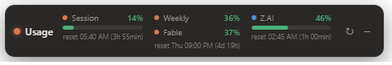

# Usage Strip (Claude + Z.AI)

A tiny always-on-top **horizontal strip** that docks just above your Windows taskbar and
shows real-time rate-limit usage for **Claude** and **Z.AI** side by side — so you never
have to open a browser tab to check how close you are to the limit.



Inspired by the taskbar *essential-mode* look of
[claude-usage-widget](https://github.com/niccolo-sabato/claude-usage-widget), but built on
Electron + plain HTML/CSS/JS and extended with a second provider (Z.AI).

## Features

- **Lives on the taskbar** — docks to the bottom-right, flush above the Windows taskbar,
  always on top, out of the way of your work. Toggle from the tray ("Dock to taskbar");
  turn it off to float and drag it anywhere.
- **Two providers, isolated** — Claude and Z.AI fetch independently, so one being down or
  missing a key never blanks out the other.
- **Quiet, readable bars** — thin severity-colored progress bars (green / amber / red) with
  the percentage above. The Weekly + per-model limits collapse into one stacked cell
  (percent only, no bars) to save horizontal space; their shared reset is shown once.
- **Reset countdowns** in the `reset 22:10 (50min)` / `reset Thu 08:59 (4d 19h)` style.
- **No telemetry, keys stay local** — data goes only to each provider's own usage endpoint.
  No key ships with the repo (`.env` is gitignored); no token or key is ever written,
  logged, or sent anywhere else.
- **Three provider modes** — Both / Claude only / Z.AI only, switched from the tray. Only
  the enabled provider(s) are polled.

## How it works

**Claude** (`src/usage.js`)
- Reads the OAuth access token Claude Code already stores at `~/.claude/.credentials.json`
  **fresh on every poll**. Claude Code keeps that token refreshed, so the overlay rides
  along and never runs its own OAuth refresh flow.
- Polls the same endpoint the Claude CLI uses:
  `GET https://api.anthropic.com/api/oauth/usage` (`anthropic-beta: oauth-2025-04-20`).
- Shows the 5-hour session, weekly (all models), and per-model (scoped, e.g. Fable) limits.

**Z.AI** (`src/zai.js`)
- Polls `GET https://api.z.ai/api/monitor/usage/quota/limit` with
  `Authorization: Bearer <ZAI_API_KEY>`.
- Shows the TOKENS_LIMIT row with a reset countdown.
- Key resolution order (first hit wins): `ZAI_API_KEY` env var → `zaiApiKey` in config →
  the widget's own `.env` file at the project root. No path or key is bundled with the
  repo — copy `.env.example` to `.env` and add your key (`.env` is gitignored), or run
  `npm run setup` to do it for you.
- Toggle on/off from the tray ("Providers").

## Install

```sh
npm install      # first time only
npm run setup    # one-time: creates your local .env and shows which providers are ready
npm start
```

`npm run setup` copies `.env.example` → `.env` (if you don't already have one), then
reports which providers are ready so you know at a glance whether to run **Claude only**,
**Z.AI only**, or **both**. Claude needs no key (it reuses Claude Code's OAuth token);
Z.AI needs `ZAI_API_KEY` in your `.env` (or as an env var).

## Run

```sh
npm start
```

Or double-click **`start-overlay.vbs`** to launch it silently (no console window). It also
clears `ELECTRON_RUN_AS_NODE`, which some parent shells (including Claude Code's own
runtime) set and which would otherwise stop Electron from starting a GUI.

## Provider modes

Three modes, switched from the tray (**Providers** submenu). Only the enabled provider(s)
are polled, so each mode "just works" with whatever credentials you have:

- **Both (Claude + Z.AI)** — default.
- **Claude only** — no key needed; reads `~/.claude/.credentials.json`.
- **Z.AI only** — needs `ZAI_API_KEY`; Claude isn't fetched.

## Controls

- **↻** refresh now. **–** collapse the strip to just its title chip (click **□** to expand
  again; the state is remembered across restarts).
- **Tray icon** (right-click) → Refresh, **Providers** (Both / Claude only / Z.AI only),
  Dock to taskbar (on/off), Click-through, Always on top (forced on while docked), Opacity,
  Launch on Windows startup, Show / Hide, Quit.
- **Show / hide** the whole overlay: click the tray icon or press **Ctrl+Shift+U** (works
  even when fully hidden).
- While docked, dragging is disabled so it stays pinned; turn "Dock to taskbar" off to move
  it freely (position is remembered).

## Config

Settings persist to `overlay-config.json` in Electron's `userData` folder
(`%APPDATA%\claude-usage-widget`). Notable keys:

| key | default | purpose |
|-----|---------|---------|
| `taskbarMode` | `true` | dock to the taskbar bottom-right |
| `opacity` | `0.95` | window opacity (0.3–1.0) |
| `clickThrough` | `false` | let mouse clicks pass through to windows behind |
| `alwaysOnTop` | `true` | stay above other windows (forced on while docked) |
| `pollSeconds` | `180` | refresh interval |
| `collapsed` | `false` | start collapsed to the title chip |
| `claudeEnabled` | `true` | poll the Claude provider |
| `zaiEnabled` | `true` | poll the Z.AI provider |
| `zaiApiKey` | — | explicit Z.AI key (overrides `.env`) |
| `zaiEnvPath` | `null` | custom `.env` path; `null` = project-root `.env` |
| `launchOnStartup` | `false` | start with Windows |

## Severity colors

| % utilization | color |
|---------------|-------|
| < 70          | green |
| 70–89         | amber |
| ≥ 90          | red   |

## Files

| File | Purpose |
|------|---------|
| `src/main.js`    | window, tray, taskbar dock, polls both providers, IPC |
| `src/usage.js`   | Claude: token read + `/api/oauth/usage` fetch + normalize |
| `src/zai.js`     | Z.AI: key read + quota endpoint fetch + normalize |
| `src/config.js`  | settings persistence + defaults |
| `src/preload.js` | contextBridge IPC surface (incl. `setSize` auto-width) |
| `src/icon.js`    | embedded tray icon |
| `src/renderer/`  | the strip UI — `index.html`, `styles.css`, `renderer.js` |
